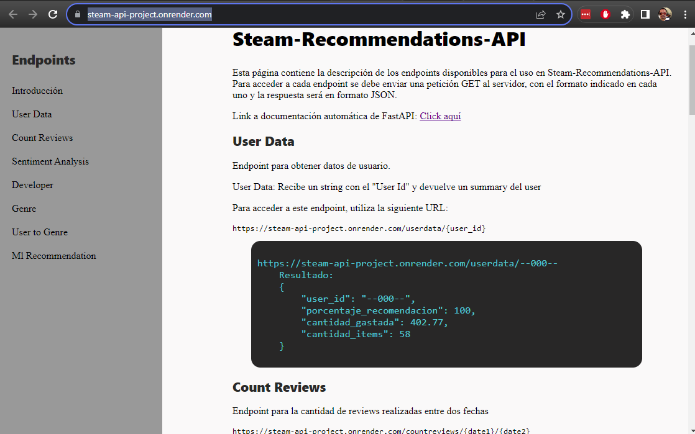

### [MACHINE LEARNING RECOMMENDATIONS](https://steam-api-project.onrender.com/)
##### by Octavio Rodriguez Rojas.

### **Introducción**
Hola! Este proyecto tiene por objetivo, entrenar un modelo que recomiende una lista de juegos en la base de datos de Steam en base a la información suministrada. Para ellos se trabajo el ETL de la base de datos, con procesos documentados de extracción, transformación y Carga de todos los documentos. Para después ser desplegados en una API donde cualquiera pueda consultar o usar esta modelo en el futuro.

------------
## Recorrido por el proyecto

 -Descarga de los Datasets originales se pueden encontrar en este [Link](https://drive.google.com/drive/folders/1HqBG2-sUkz_R3h1dZU5F2uAzpRn7BSpj)

### -> TRANSFORMACIÓN DE LA BASE DE DATOS
- Carga de datos en  por medio de la biblioteca 
- Dentro de las acciones para trabajar los datasets se requirió
- Desanidar las columnas
- Limpiar nulos cuando formaban parte de las consultas
- Remover duplicados en los archivos
- Modificar los formatos de los precios 
- Modificar el formato de las fechas
- Crear Dummies de valores binarios para optimizar la carga de las consultas y modelos de machine learning
- Se realizo una transformación de NLP (Procesamiento de Lenguaje Natural) en las review de los usuarios para valorizar los comentarios como positivos o negativos
- Por último, se eliminaron columnas innecesarias   
Todo esto se encuentra en los archivos 

    - [01_data_engineering.ipynb](./01_data_engineering.ipynb)
    - [02_nlp_sentiment_nltk.py](./02_nlp_sentiment_nltk.py)

## -> DESARROLLO API
En un entorno virtual en Python 🐍 se crearon 6 funciones para los endpoints que se consumirán en la API, se disponibilizaron los datos usando el framework **FastAPI**

Ademas de crear una [página](https://steam-api-project.onrender.com/) de documentación donde se explica la función de cada endpoint para los futuros usuarios

Las funciones fueron las siguientes:
1. **def userdata (user_id)** -> AL ingresar el user id en formato string, retorna: un resumen de las actividades del usuario: id, porcentaje de recomendacion de sus juegos, cantidad gastada y cantidad de juegos en su inventario.
2. **def countreviews (Fecha_inicio , Fecha_final)** -> AL ingresar un rango de fechas devuelve la cantidad de reviews que se generaron en ese periodo
3. **def sentimentanalysis (Año)** -> Al ingresar el año de lanzamiento devuelve una suma de la cantidad de reseñas positivas, negativas y neutras para los titulos estrenados ese año
4. **def genre (Genero)** -> Al ingresar el genero que se desea evaluar regresa el ranking de por horas jugadas en comparación con todos los demás géneros
5. **def userforgenre (Genero)** -> Al ingresar el un genero retorna el top 5 de los jugadores con mas horas en ese genero de video juego.
6. **def developer (Desarrollador)** -> Al ingresar el nombre de desarrollador de video juego retorna, un lista por años con la siguiente información: año de lanzamiento, juego lanzados ese año, porcentaje de juegos free to play en ese año

La creación de las consultas y la API de juegos se encuentra detallada en los archivos

- [main.py](./main.py)
- [03_consultas_endpoints.ipynb](./03_consultas_endpoints.ipynb)

**nota** Para utilizar el entorno virtual en Python de manera local, se debe primero instalar virtualenv, seguido del siguiente código de activación (WINDOWS):

`pip install virtualenv`

`python -m venv venv`

`venv\Scripts\activate`

`pip install -r requirements.txt`

`uvicorn main:app --reload` #para levantar el servidor

## -> DEPLOYMENT
El desplegado se hizo en la plataforma de *RENDER* al que se puede acceder através del siguientes link: 
[https://steam-api-project.onrender.com/](https://steam-api-project.onrender.com/)

## -> ANÁLISIS EXPLORATORIO DE LOS DATOS
Se realizó un análisis más profundo, examinando cada columna que conformaba el dataset que surgio de la primera transformación, se tomaron decisiones de acuerdo a la experiencia personal, y con base a resultados de la búsqueda de outliers, todo enfocado a obtener el dataset óptimo para la parte del modelado de datos

El archivo correspondiente a este análisis, lo encuentras en el siguiente archivo [04_EDA.ipynb](04_EDA.ipynb)

## -> SISTEMA DE RECOMENDACIÓN
Una vez con el dataset listo, con las columnas creando un profile de palabras usamos la libreria **Scikit-learn**, la cuál se debe de descargar previamente con el siguiente código (Windows): 

`pip install -U scikit-learn`

Se procedió al entrenamiento del modelo, para ello, primero se vectorizó con *TfidfVectorizer* y se obtuvo el valor escalar con *tfidf*.

Para entrenar el modelo ya con el profile vectorizado, se utilizo por NearestNeighbors para encontrar los puntos mas cercanos en la matriz a través de un algoritmo **Cosine**

El modelo se corrio para todos los elementos del dataframe para luego ser cargado a la api para mejorar el tiempo de respuesta en menos de 1 segundo.

Esto se puede ver en la Api con el siguiente endpoint

**def game_recommendations(titulo)** -> Al ingresar el id de un juego devuelve: el titulo del juego a comparar, una lista de los 5 juego recomendados con su titulo e Id.

El archivo correspondiente al código para el sistema de recomendación en el siguiente archivo [05_ml_model.ipynb](05_ml_model.ipynb)

------------

### ABRE Y EJECUTA LOS ARCHIVOS

